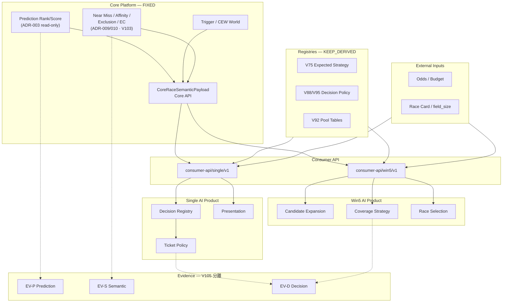

# Version107 — Architecture Diagram

**Date:** 2026-07-28  
**Parent:** ADR-011  
**Status:** Design only · **実装禁止**

---

## 1. 全体図



---

## 2. データ流（Single）

```text
Core API payload
    │
    ├─ world_id / near_miss ──► Decision Registry ──► policy_id
    │                                                      │
    ├─ prediction.ranks ───────────────────────────────────┼──► Ticket Policy ──► TicketPlan
    │                              EXT(odds,budget) ───────┘
    │
    └─ Exclusion / NM / Affinity / EC / Transition / MustGaps
           + strategy_ref
           ──► Presentation ──► structured + optional NL
```

---

## 3. データ流（Win5）

```text
Core API payload(s)
    │
    ├─ world/NM + ranks + V92 Pool ──► Candidate Expansion ──► CandidateSet
    ├─ world/NM Risk profile + EXT ──► Coverage Strategy ──► CoveragePlan
    └─ World/NM/EC + EXT(field_size) + Product rules
           ──► Race Selection ──► include / reason_codes
               ※ race_difficulty フィールドは作らない（V106）
```

---

## 4. Flag 境界

```text
W_CORE_PAYLOAD_V103          → PROMOTE フィールドの可視性
W_CONSUMER_SINGLE_ENABLED    → Single Consumer API
W_CONSUMER_WIN5_ENABLED      → Win5 Consumer API
W_DECISION_* (ADR-008)       → Ticket/Pool/Explain/Risk 実行
W_CONSUMER_CANDIDATE_EXPAND  → Win5 候補拡張
W_CONSUMER_COVERAGE          → Win5 カバレッジ
W_CONSUMER_RACE_SELECT       → Win5 レース選定
W_CONSUMER_PRESENTATION_NL   → NL 説明

総スイッチ OFF = Legacy Product 経路（Core 意味は不変）
```

---

## 5. 非接続（意図的）

| From | To | 理由 |
|---|---|---|
| EV-P Miss | Consumer Ticket 必須入力 | V105 |
| Affinity | 自動 Skip / 保険閾値 | V97 |
| EC | 勝率 / 単独 Skip 閾値 | ADR-010 / V101 |
| Consumer Ticket | Core Payload | PCS-7 |
| Win5 difficulty | Core Semantic | V106 GAP-SEM=0 |

---

## Related

- ADR-011
- `v107-consumer-api.md`
- `v107-migration-plan.md`
