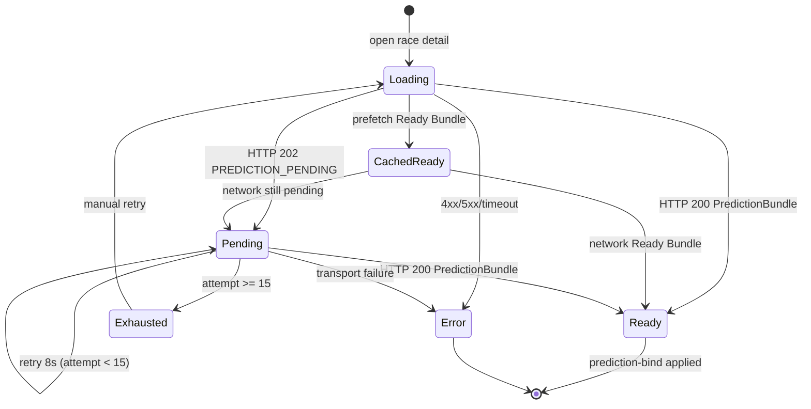

# Phase UI4 — Pending State Flow

**Scope:** Race detail client only（`public/race.html`）  
**Non-goals:** Core / Consumer / Prediction engine / Contract / Race List Cache

---

## Pending State Flow

```
GET/POST detail API
        │
        ├─ HTTP 200 + PredictionBundle
        │     → Contract Guard
        │     → ExpectPredictionBind.applyRaceDetail
        │
        ├─ HTTP 202 + PREDICTION_PENDING
        │     → Pending State（Bundle ではない）
        │     → UI: 「AI予想を生成しています」
        │     → skeleton 維持
        │     → Retry Flow へ
        │
        └─ HTTP 4xx/5xx / timeout
              → Error State（既存）
```

### ルール

1. `result.pending === true` のとき **絶対に** `validatePredictionBundle` しない  
2. `{ bundle: null, pending: true, meta }` を Bundle にフォールバックしない  
3. Ready Bundle のみ `prediction-bind` へ渡す

---

## Retry Flow

| Parameter | Value |
|---|---|
| Interval | 8s（RealtimeSync active tick と整合） |
| Max attempts | 15（≈ 2 分） |
| Loader | 同一 `getWithMeta`（Flag OFF=Prediction / ON=SingleDetail） |
| Success | clear timer → bind |
| Exhausted | 「準備に時間がかかっています」+ 手動再読み込み |

```
Pending
  → wait 8s
  → fetchDetailOnce()
      ├─ still pending → Pending（attempt++）
      ├─ Ready Bundle  → bind + stop
      └─ error         → Error State + stop
  → attempt >= 15 → Exhausted（manual retry resets counter）
```

---

## State Diagram



### State meanings

| State | UI | Guard | Bind |
|---|---|---|---|
| Loading | skeleton | — | — |
| Pending | 「AI予想を生成しています」 | **not run** | — |
| Ready | AI 予想 | validate OK | applyRaceDetail |
| Exhausted | 時間超過 + 再読み込み | not run | — |
| Error | 既存エラーカード | not run on pending | — |

---

## Bug fixed (root)

Before UI4:

```js
var bundle = result && result.bundle ? result.bundle : result;
// pending → bundle=null → falsy → bundle = result (envelope)
// → validatePredictionBundle(envelope) → 契約不一致
```

After UI4:

```js
if (result.pending) return false;
var hasBundleKey = Object.prototype.hasOwnProperty.call(result, "bundle");
var bundle = hasBundleKey ? result.bundle : result;
if (!bundle) return false;
```
