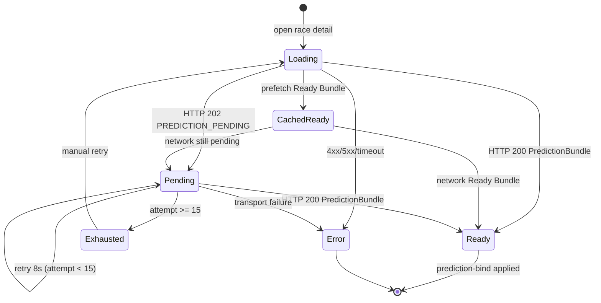

# Phase UI4 — State Diagram

| State | User-facing | validatePredictionBundle | prediction-bind |
|---|---|---|---|
| Loading | skeleton | no | no |
| Pending | AI予想を生成しています | **no** | no |
| Ready | AI 予想 UI | yes | yes |
| Exhausted | 時間超過 + 再読み込み | no | no |
| Error | 既存エラー | no | no |

詳細フロー: [v109-ui4-pending-state-flow.md](./v109-ui4-pending-state-flow.md)
