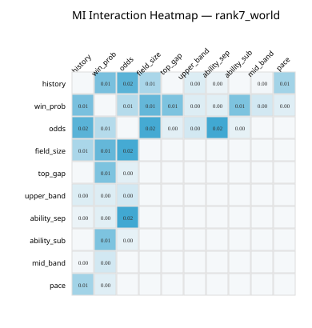
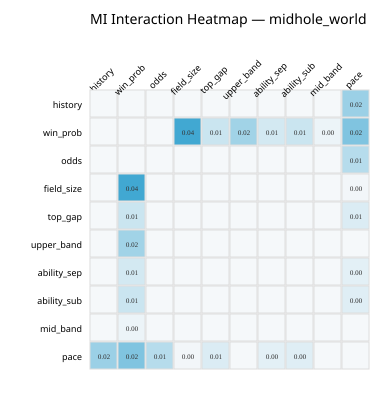
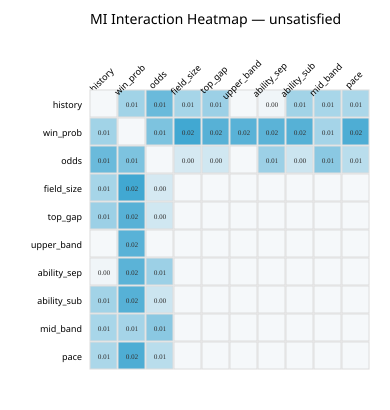
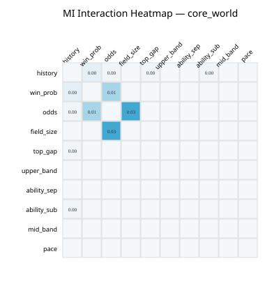

# Version81 — Interaction Heatmap

**Generated:** `2026-07-28T09:18:46+00:00`  
セル値 = 2-way Interaction の **Mutual Information**（対角は 0）。単体効果ではない。

## `rank7_world`

|  | `history` | `win_prob` | `odds` | `field_size` | `top_gap` | `upper_band` | `ability_sep` | `ability_sub` | `mid_band` | `pace` |
|---|---:|---:|---:|---:|---:|---:|---:|---:|---:|---:|
| `history` | — | 0.012 | 0.015 | 0.007 | 0.000 | 0.002 | 0.001 | 0.000 | 0.000 | 0.008 |
| `win_prob` | 0.012 | — | 0.006 | 0.014 | 0.012 | 0.002 | 0.002 | 0.012 | 0.004 | 0.002 |
| `odds` | 0.015 | 0.006 | — | 0.018 | 0.002 | 0.003 | 0.018 | 0.001 | 0.000 | 0.000 |
| `field_size` | 0.007 | 0.014 | 0.018 | — | 0.000 | 0.000 | 0.000 | 0.000 | 0.000 | 0.000 |
| `top_gap` | 0.000 | 0.012 | 0.002 | 0.000 | — | 0.000 | 0.000 | 0.000 | 0.000 | 0.000 |
| `upper_band` | 0.002 | 0.002 | 0.003 | 0.000 | 0.000 | — | 0.000 | 0.000 | 0.000 | 0.000 |
| `ability_sep` | 0.001 | 0.002 | 0.018 | 0.000 | 0.000 | 0.000 | — | 0.000 | 0.000 | 0.000 |
| `ability_sub` | 0.000 | 0.012 | 0.001 | 0.000 | 0.000 | 0.000 | 0.000 | — | 0.000 | 0.000 |
| `mid_band` | 0.000 | 0.004 | 0.000 | 0.000 | 0.000 | 0.000 | 0.000 | 0.000 | — | 0.000 |
| `pace` | 0.008 | 0.002 | 0.000 | 0.000 | 0.000 | 0.000 | 0.000 | 0.000 | 0.000 | — |

## `midhole_world`

|  | `history` | `win_prob` | `odds` | `field_size` | `top_gap` | `upper_band` | `ability_sep` | `ability_sub` | `mid_band` | `pace` |
|---|---:|---:|---:|---:|---:|---:|---:|---:|---:|---:|
| `history` | — | 0.000 | 0.000 | 0.000 | 0.000 | 0.000 | 0.000 | 0.000 | 0.000 | 0.018 |
| `win_prob` | 0.000 | — | 0.000 | 0.036 | 0.008 | 0.016 | 0.007 | 0.008 | 0.002 | 0.023 |
| `odds` | 0.000 | 0.000 | — | 0.000 | 0.000 | 0.000 | 0.000 | 0.000 | 0.000 | 0.012 |
| `field_size` | 0.000 | 0.036 | 0.000 | — | 0.000 | 0.000 | 0.000 | 0.000 | 0.000 | 0.001 |
| `top_gap` | 0.000 | 0.008 | 0.000 | 0.000 | — | 0.000 | 0.000 | 0.000 | 0.000 | 0.005 |
| `upper_band` | 0.000 | 0.016 | 0.000 | 0.000 | 0.000 | — | 0.000 | 0.000 | 0.000 | 0.000 |
| `ability_sep` | 0.000 | 0.007 | 0.000 | 0.000 | 0.000 | 0.000 | — | 0.000 | 0.000 | 0.003 |
| `ability_sub` | 0.000 | 0.008 | 0.000 | 0.000 | 0.000 | 0.000 | 0.000 | — | 0.000 | 0.004 |
| `mid_band` | 0.000 | 0.002 | 0.000 | 0.000 | 0.000 | 0.000 | 0.000 | 0.000 | — | 0.000 |
| `pace` | 0.018 | 0.023 | 0.012 | 0.001 | 0.005 | 0.000 | 0.003 | 0.004 | 0.000 | — |

## `unsatisfied`

|  | `history` | `win_prob` | `odds` | `field_size` | `top_gap` | `upper_band` | `ability_sep` | `ability_sub` | `mid_band` | `pace` |
|---|---:|---:|---:|---:|---:|---:|---:|---:|---:|---:|
| `history` | — | 0.009 | 0.014 | 0.008 | 0.009 | 0.000 | 0.000 | 0.009 | 0.008 | 0.008 |
| `win_prob` | 0.009 | — | 0.012 | 0.019 | 0.016 | 0.016 | 0.016 | 0.016 | 0.008 | 0.017 |
| `odds` | 0.014 | 0.012 | — | 0.003 | 0.004 | 0.000 | 0.009 | 0.004 | 0.011 | 0.006 |
| `field_size` | 0.008 | 0.019 | 0.003 | — | 0.000 | 0.000 | 0.000 | 0.000 | 0.000 | 0.000 |
| `top_gap` | 0.009 | 0.016 | 0.004 | 0.000 | — | 0.000 | 0.000 | 0.000 | 0.000 | 0.000 |
| `upper_band` | 0.000 | 0.016 | 0.000 | 0.000 | 0.000 | — | 0.000 | 0.000 | 0.000 | 0.000 |
| `ability_sep` | 0.000 | 0.016 | 0.009 | 0.000 | 0.000 | 0.000 | — | 0.000 | 0.000 | 0.000 |
| `ability_sub` | 0.009 | 0.016 | 0.004 | 0.000 | 0.000 | 0.000 | 0.000 | — | 0.000 | 0.000 |
| `mid_band` | 0.008 | 0.008 | 0.011 | 0.000 | 0.000 | 0.000 | 0.000 | 0.000 | — | 0.000 |
| `pace` | 0.008 | 0.017 | 0.006 | 0.000 | 0.000 | 0.000 | 0.000 | 0.000 | 0.000 | — |

## `core_world`

|  | `history` | `win_prob` | `odds` | `field_size` | `top_gap` | `upper_band` | `ability_sep` | `ability_sub` | `mid_band` | `pace` |
|---|---:|---:|---:|---:|---:|---:|---:|---:|---:|---:|
| `history` | — | 0.003 | 0.001 | 0.000 | 0.001 | 0.000 | 0.000 | 0.001 | 0.000 | 0.000 |
| `win_prob` | 0.003 | — | 0.013 | 0.000 | 0.000 | 0.000 | 0.000 | 0.000 | 0.000 | 0.000 |
| `odds` | 0.001 | 0.013 | — | 0.031 | 0.000 | 0.000 | 0.000 | 0.000 | 0.000 | 0.000 |
| `field_size` | 0.000 | 0.000 | 0.031 | — | 0.000 | 0.000 | 0.000 | 0.000 | 0.000 | 0.000 |
| `top_gap` | 0.001 | 0.000 | 0.000 | 0.000 | — | 0.000 | 0.000 | 0.000 | 0.000 | 0.000 |
| `upper_band` | 0.000 | 0.000 | 0.000 | 0.000 | 0.000 | — | 0.000 | 0.000 | 0.000 | 0.000 |
| `ability_sep` | 0.000 | 0.000 | 0.000 | 0.000 | 0.000 | 0.000 | — | 0.000 | 0.000 | 0.000 |
| `ability_sub` | 0.001 | 0.000 | 0.000 | 0.000 | 0.000 | 0.000 | 0.000 | — | 0.000 | 0.000 |
| `mid_band` | 0.000 | 0.000 | 0.000 | 0.000 | 0.000 | 0.000 | 0.000 | 0.000 | — | 0.000 |
| `pace` | 0.000 | 0.000 | 0.000 | 0.000 | 0.000 | 0.000 | 0.000 | 0.000 | 0.000 | — |
