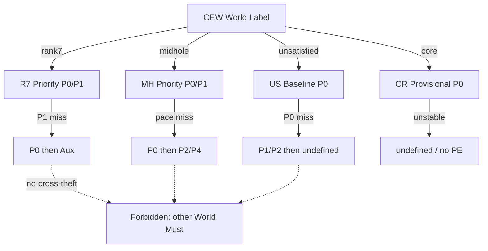

# Version82 — Interaction Priority / Conflict / Fallback

**Date:** 2026-07-28  
**Type:** Design Spec ONLY  
**Parents:** `v82-interaction-strategy.md` / `v82-interaction-contract.md`  
**実装禁止 / PE・Production・Trigger・Blueprint 変更禁止**

---

## 用語

| 語 | 定義 |
|---|---|
| **Priority** | 同一 World 内で同時に複数 Interaction が発火し得るときの適用順位（P0 が最優先） |
| **Conflict** | 同時適用すると意味が矛盾する Interaction 組 |
| **Fallback** | 上位 Interaction が欠測・不発火のときの代替経路（Aux 昇格規則を含む） |
| **発火** | 設計上の「当該 Interaction を読む条件が揃う」こと（実装閾値は未定義・本フェーズ非対象） |

---

## 共通 Priority 規則

| ID | 規則 |
|---|---|
| P-G0 | 単体特徴は Priority キューに **入れない**。 |
| P-G1 | 同一原子集合の 2-way と 3-way が共存する場合、**3-way は 2-way の強化**であり置換ではない。ただし Conflict 表で排他指定があればそれに従う。 |
| P-G2 | Must 同士が Conflict のとき、**P 番号の小さい方を採用**し、他方は抑制（削除ではなく抑制）。 |
| P-G3 | Aux は Must を上書きしない。 |
| P-G4 | Fallback は「より弱い Interaction」または「共通 Baseline」への降下であり、他 World の Must 盗用ではない。 |
| P-G5 | World 未決定 / CEW=`unsatisfied` のとき、Positive World Priority 表を適用しない。 |

---

## `rank7_world` Priority

```
P0  history × win_prob                         [Must]
P1  history × odds × win_prob                  [Must 強化]
P2  odds × ability_sep                         [Aux]
P3  history × odds                             [Aux]
P4  win_prob × odds                            [Aux]
P5  odds × upper_band                          [Aux]
P6  history × upper_band × odds                [Aux]
```

### Conflict

| ID | A | B | 解決 |
|---|---|---|---|
| R7-C1 | `history × win_prob` 同格バンド | 「win_prob 単独主軸」相当の読み | A を採用。B Forbidden。 |
| R7-C2 | P0/P1（履歴込み） | midhole 由来 `win_prob × field_size` を主ゲート化 | P0/P1 維持。field_size 主ゲートは抑制。 |
| R7-C3 | P1 三重 | P3 `history × odds` と P4 `win_prob × odds` の二重加算 | P1 採用時は P3/P4 を **二重計上しない**（情報は P1 に内包）。 |
| R7-C4 | `odds × upper_band` 強化 | midhole 的 `win_prob × upper_band` 減衰コピーの混在 | World 固有表のみ。他 World 規則混入禁止。 |

### Fallback

| 欠落 | Fallback 順 |
|---|---|
| P1 欠測（odds 欠等） | P0 → P3 または P4（二重計上禁止）→ P2 |
| P0 欠測 | **不可**: rank7 Strategy 不成立。共通 Baseline（`unsatisfied` US-M1）へは **World ラベル変更時のみ**。同一レースで盗用しない。 |
| P2–P6 欠測 | 無視（Must のみで可） |
| pace 欠測 | rank7 Must 非依存のため影響なし |

---

## `midhole_world` Priority

```
P0  win_prob × field_size                      [Must]
P1  history × pace                             [Must]
P2  history × field_size                       [Aux / 準 Must]
P3  win_prob × field_size × pace               [Aux 強化]
P4  history × field_size × top_gap             [Aux]
P5  history × odds × win_prob                  [Aux・昇格禁止]
```

### Conflict

| ID | A | B | 解決 |
|---|---|---|---|
| MH-C1 | P0 field_size ゲート | rank7 `history × win_prob` 同格 Must | P0/P1 維持。同格 Must コピー禁止。 |
| MH-C2 | P1 `history × pace` | `win_prob` 単体主軸 | P1（および P0）優先。単体 Forbidden。 |
| MH-C3 | P3（P0+pace） | P0 のみ | P3 発火時は P0 を内包扱い（二重ゲート禁止）。 |
| MH-C4 | P5 汎用三重 | P0/P1 | P5 は Aux 固定。Must を上書きしない。 |
| MH-C5 | `win_prob × upper_band` 強化読み | P0/P1 | 強化読み Forbidden。衝突時は破棄。 |

### Fallback

| 欠落 | Fallback 順 |
|---|---|
| pace 欠測（P1/P3） | P0 → P2 → P4（top_gap 利用可なら）→ P5（最終 Aux） |
| field_size 欠測 | **致命的**: P0 不成立。P1 のみでは midhole Strategy Partial。P5 への安易な置換は Forbidden（rank7 化）。 |
| P0+P1 両方欠測 | midhole Strategy 不成立。他 World Must 転用禁止。 |

---

## `unsatisfied` Priority

```
P0  history × win_prob                         [Must Baseline]
P1  win_prob × odds                            [Aux]
P2  history × odds                             [Aux]
P3  win_prob × field_size                      [Aux]
P4  history × win_prob × odds                  [Aux 強化]
P5  win_prob × field_size × pace               [Aux]
```

### Conflict

| ID | A | B | 解決 |
|---|---|---|---|
| US-C1 | P0 Baseline | rank7「勝ち筋同格」主張 | 文字列が同じでも **意味 Role は Baseline**。勝ち筋主張 Forbidden。 |
| US-C2 | P3 field_size Aux | midhole P0 Must 転用 | Aux に留める。Must 昇格禁止。 |
| US-C3 | P4 三重 | P1+P2 二重加算 | P4 採用時は P1/P2 二重計上禁止。 |
| US-C4 | 固有勝ち筋 Must の追加 | Residual 契約 | 追加 Must は Conflict＝破棄（US-F1）。 |

### Fallback

| 欠落 | Fallback 順 |
|---|---|
| P0 欠測 | P1 → P2 →（両方欠なら）評価不能標識。他 World Must 禁止。 |
| P4 欠測 | P0 +（P1 または P2） |
| pace 欠測 | P5 スキップ |

---

## `core_world` Priority（PROVISIONAL）

```
P0  win_prob × odds                            [Must 仮]
P1  history × win_prob                         [Aux 仮]
P2  history × odds × win_prob                  [Aux 仮]
P3  win_prob × field_size × top_gap            [Aux 仮]
```

### Conflict

| ID | A | B | 解決 |
|---|---|---|---|
| CR-C1 | 本 Priority を ACTIVE 扱い | PROVISIONAL 契約 | PROVISIONAL 優先（Ready 主張 Forbidden）。 |
| CR-C2 | P0 | 他 World Must の混在適用 | P0 のみ（仮）。混在禁止。 |

### Fallback

| 欠落 | Fallback 順 |
|---|---|
| P0 欠測 | P1 → P2。それでも欠なら **Strategy 未定義**（標本不足）。 |
| 全体 | Production / Pilot Fallback への接続は **本設計の範囲外（禁止）**。 |

---

## Cross-World Conflict（Selector 層）

| ID | 状況 | 解決 |
|---|---|---|
| X-C1 | 同一レースに複数 Positive World Must を同時適用 | CEW は単一ラベル前提。複数適用禁止。 |
| X-C2 | Positive World 不成立 → unsatisfied | unsatisfied Priority のみ。直前 World の Must を持ち越さない。 |
| X-C3 | midhole ↔ rank7 で同一ペア（例: history×win_prob） | Role 表が異なる。ラベルに従い一方のみ。 |
| X-C4 | V80 単体 Weight Shadow との併存 | V82 設計上は単体 Weight **無効**。併存時は Interaction Priority のみ有効（実装は別 Decision）。 |

---

## Fallback 総図（概念）



---

## 非範囲

- 発火閾値・スコア写像・PE API  
- Production Pilot / Feature Flag  
- Trigger / Blueprint 変更  
